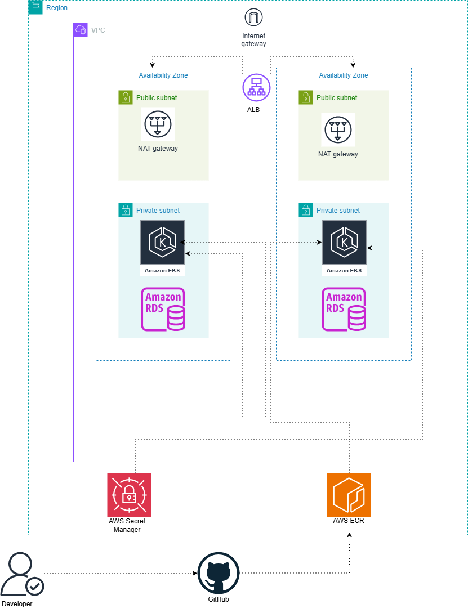
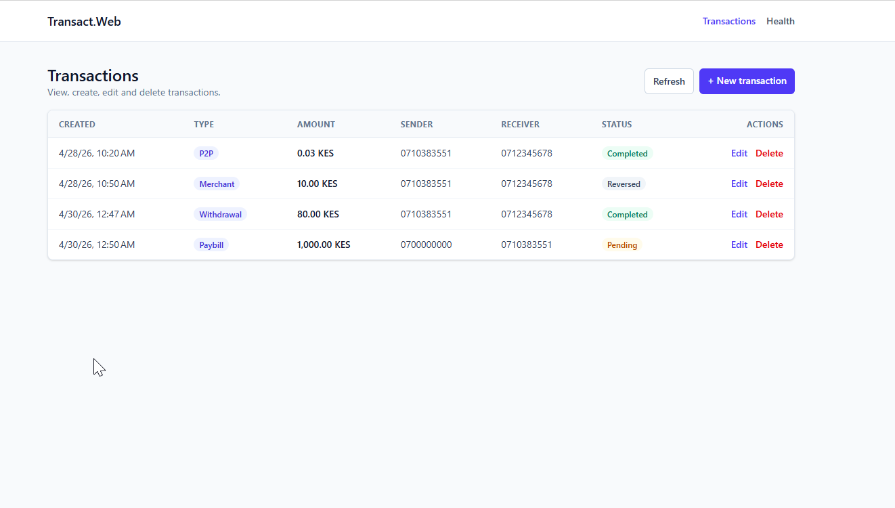
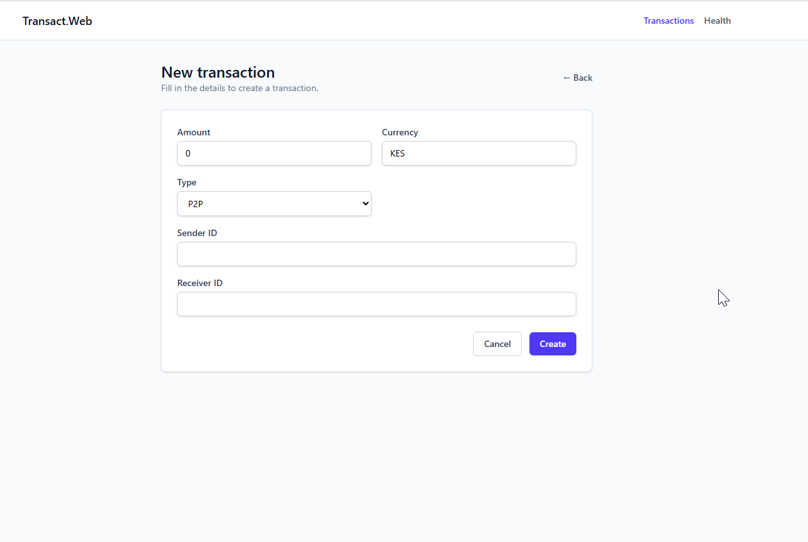
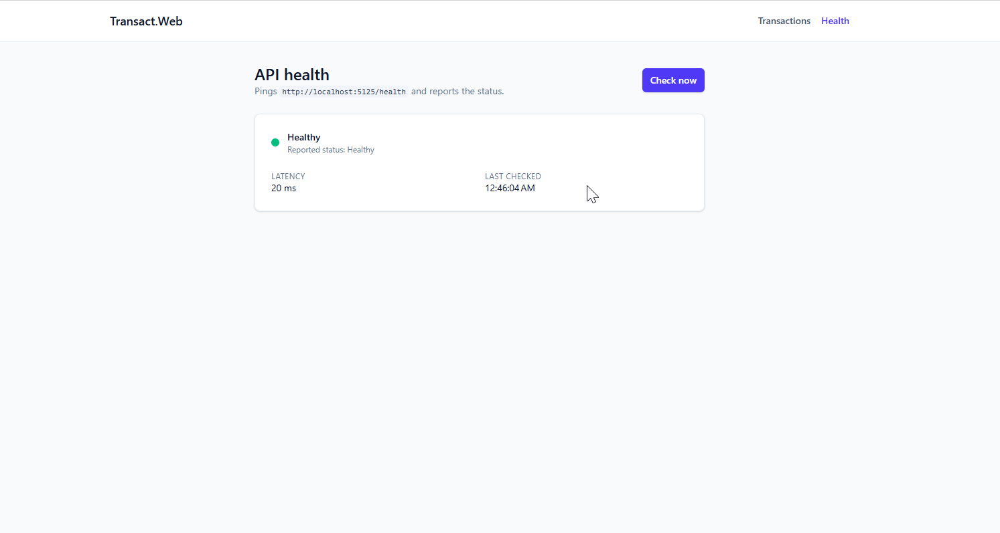

# Transact

A small full-stack sample (.NET 10 minimal API + Angular 21 SPA) used as a
vehicle for the **DevOps story**: containerized workloads, AWS infrastructure
as code, GitHub Actions CI/CD over OIDC, and a GitOps-style deploy to EKS
fronted by the Gateway API.

> **Reading this for assessment?** Start with [TL;DR](#tldr) and
> [Architecture](#architecture). Local-dev sections are collapsed at the
> bottom.

---

## TL;DR

| Area | Choice |
| --- | --- |
| Compute | **EKS** managed node group, 2 AZs |
| Ingress | **Gateway API** -> ALB via AWS Load Balancer Controller (IRSA) |
| Data | **RDS PostgreSQL** in private subnets |
| Secrets | **Secrets Manager** -> cluster via **External Secrets Operator** (IRSA) |
| Registry | **ECR** (single repo, `api-`/`web-` tag prefixes) |
| IaC | **CloudFormation** nested stacks under [aws/](aws/) |
| CI/CD | **GitHub Actions + OIDC** (no long-lived AWS keys) |
| Promotion | Branch-per-env: `develop`->dev, `test`->test, `main`->prod |

---

## Architecture



**Request path**

```
Browser --> ALB (rendered from K8s Gateway/HTTPRoute)
             |- /api/* --> Service transact-api --> Pods (.NET) --> RDS
             \- /*     --> Service transact-web --> Pods (nginx + SPA)
```

**Secret path**

```
RDS --(master creds at create)--> Secrets Manager
                                       |  (IRSA, ESO ClusterSecretStore)
                                       v
                       K8s Secret transact-db-connection
                                       |
                                       v
              transact-api  (ConnectionStrings__DefaultConnection)
```

**Components**

- **VPC** - 2 public (NAT, ALB) + 2 private subnets (EKS nodes, RDS) across 2 AZs.
- **EKS** - managed control plane + node group; per-env sizing via `EnvDefaults` in [aws/compute/eks.yaml](aws/compute/eks.yaml). Core add-ons via CFN; ESO + ALB controller installed by [bootstrap.yml](.github/workflows/bootstrap.yml) using IRSA.
- **RDS PostgreSQL** - private, encrypted, SG allows 5432 only from inside the VPC. Master creds auto-generated into Secrets Manager ([aws/secrets/db-secret.yaml](aws/secrets/db-secret.yaml)).
- **External Secrets Operator** - IRSA-bound; renders `transact-db-connection` Secret consumed by the API.
- **AWS Load Balancer Controller + Gateway API** - `ALBGatewayAPI` feature gate on; reconciles the `transact` Gateway/HTTPRoute into an ALB with `/api/*` prefix rewrite.
- **ECR** - one repo per env (`transact-<env>-<region>-ecr-01`); tag prefix distinguishes images; lifecycle policy keeps the latest N.

---

## CI/CD pipelines

Workflows under [.github/workflows](.github/workflows):

| Workflow | Trigger | Purpose |
| --- | --- | --- |
| [`ci.yml`](.github/workflows/ci.yml) | push / PR | Build + test .NET and Angular. No AWS access. |
| [`infra.yml`](.github/workflows/infra.yml) | push to env branch under `aws/**`, or manual | Validate + deploy CFN root stack ([aws/main.yaml](aws/main.yaml)) and nested stacks. |
| [`bootstrap.yml`](.github/workflows/bootstrap.yml) | auto after `infra.yml` (`workflow_run`), or manual | Idempotent Helm install of ESO + AWS LB Controller, wired to IRSA roles. |
| [`cd.yml`](.github/workflows/cd.yml) | manual | Build + push images, render manifests from stack outputs, `kubectl apply`, wait for rollout. |
| [`rollback.yml`](.github/workflows/rollback.yml) | manual | Roll a Deployment back to its previous revision. |

**Branch -> env (gates via GitHub Environments)**

| Branch | Env | Approval |
| --- | --- | --- |
| `develop` | dev | none |
| `test` | test | required reviewers |
| `main` / `master` | prod | required reviewers |

**Flow on push to `develop`**

```
ci.yml --> infra.yml --> bootstrap.yml --> cd.yml (manual)
```

<details>
<summary><strong>cd.yml stage breakdown</strong></summary>

1. Resolve target env from branch (or workflow input).
2. Compute image tag `${env}-${shortSHA}` and ECR repo name.
3. AWS OIDC + ECR login (short-lived creds).
4. Build & push API + Web images (`docker/build-push-action@v6`, GHA cache, multi-tag).
5. Resolve `EksClusterName` and `DbEndpointAddress` from CFN root stack outputs.
6. Render manifests via `sed` (image URIs, RDS host, per-env Secrets Manager key).
7. `kubectl apply` in dependency order: namespace -> ClusterSecretStore -> ConfigMap -> ExternalSecret -> Services -> Deployments -> Gateway/HTTPRoutes.
8. Wait for `transact-api` and `transact-web` rollouts.

</details>

---

## Assumptions


- **Single AWS account per env** - separation by stack name + GitHub Environment, not account boundary.
- **Branch-per-env**, no tag-based promotion.
- **Fresh image per CD run** - no "promote dev image to prod" step.
- **Master DB user only** - no separate app role yet.
- **Public Gateway + EKS API endpoint** for convenience; prod would lock both down (private endpoint, IP allow-list, WAF/Shield).
- **GitHub OIDC role pre-exists** (`secrets.AWS_ROLE_TO_ASSUME`).
- **Helm chart versions pinned** in `bootstrap.yml`; upgrades require a re-run.

---

## Things I'd improve next

- **Replace `sed` templating with Helm/Kustomize.** Per-app chart with `values-{dev,test,prod}.yaml` makes image tags, replicas, limits, and the Secrets Manager key typed inputs - and unlocks `helm diff` on PRs.
- **Smoke test after rollout.** Today `cd.yml` only waits on `kubectl rollout status`; add a `/health/ready` + `POST /transactions` round-trip through the ALB with auto-rollback on failure.
- **Monitoring & alerting.** CloudWatch Alarms on API 5xxs, RDS CPU, etc., with SNS notifications. In-cluster Prometheus + Grafana for app metrics and API latency.

---

## Application reference

<details>
<summary><strong>Solution layout</strong></summary>

| Project | Purpose |
| --- | --- |
| [Transact.Domain](Transact.Domain) | Entities (`Transaction`), enums (`TransactionType`). |
| [Transact.Application](Transact.Application) | CQRS via MediatR - commands, queries, repository interfaces. |
| [Transact.Infrastructure](Transact.Infrastructure) | EF Core `AppDbContext`, repositories, migrations. |
| [Transact.Api](Transact.Api) | Minimal API + Swagger + CORS. |
| [Transact.Web](Transact.Web) | Angular 21 standalone SPA (Tailwind, signals). |

</details>

<details>
<summary><strong>API endpoints</strong></summary>

| Method | Route | Description |
| --- | --- | --- |
| `GET`    | `/transactions`      | List all |
| `GET`    | `/transactions/{id}` | Get one |
| `POST`   | `/transactions`      | Create |
| `PUT`    | `/transactions/{id}` | Update |
| `DELETE` | `/transactions/{id}` | Delete |
| `GET`    | `/health`            | Health probe |

`TransactionType` is serialized as a string (`P2P`, `Merchant`, `Paybill`, `Withdrawal`).

</details>

<details>
<summary><strong>Screens</strong></summary>

Transactions list (CRUD with type pills + status badges):



New transaction (`POST /transactions`):



API health (pings `/health`, reports status + latency):



</details>

---

## Local development

<details>
<summary><strong>Prerequisites</strong></summary>

- .NET 10 SDK
- Node.js 20+ and npm 10+
- Docker Desktop / Engine + Compose v2 (for the containerized run)
- (Optional) `dotnet dev-certs https --trust` if you switch the API to HTTPS

</details>

<details>
<summary><strong>Quick start with Docker</strong></summary>

```powershell
cp .env.example .env   # set a real POSTGRES_PASSWORD
docker compose up --build
```

Open http://localhost:8080.

Brings up:

- `db`  - Postgres 17 (volume `db-data`)
- `api` - .NET 10 minimal API, migrations applied on startup, listens on `:8080`
- `web` - nginx serving the built SPA on `${WEB_PORT:-8080}` and proxying `/api/*` to `api:8080`

The SPA detects its origin and switches `apiBaseUrl`:

| Environment | SPA origin | `apiBaseUrl` |
| --- | --- | --- |
| `npm start` (dev) | `http://localhost:4200` | `http://localhost:5125` |
| Docker (nginx)    | `http://localhost:8080` | `/api` |

All secrets/config come from `.env`. `appsettings.json` has no connection string -
it is provided via `ConnectionStrings__DefaultConnection`.

</details>
